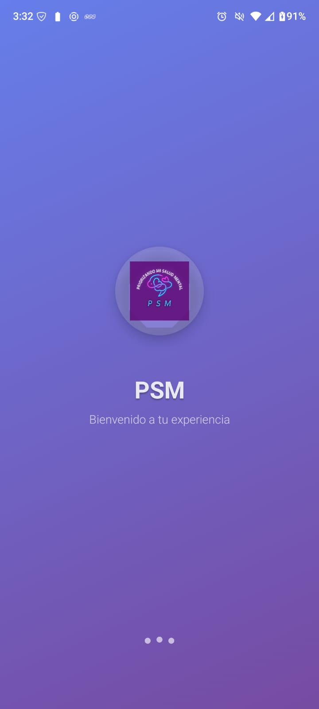
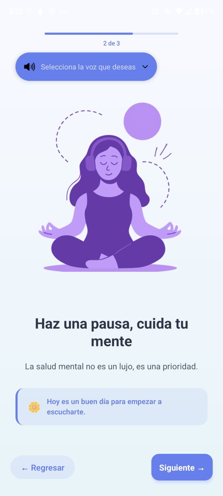
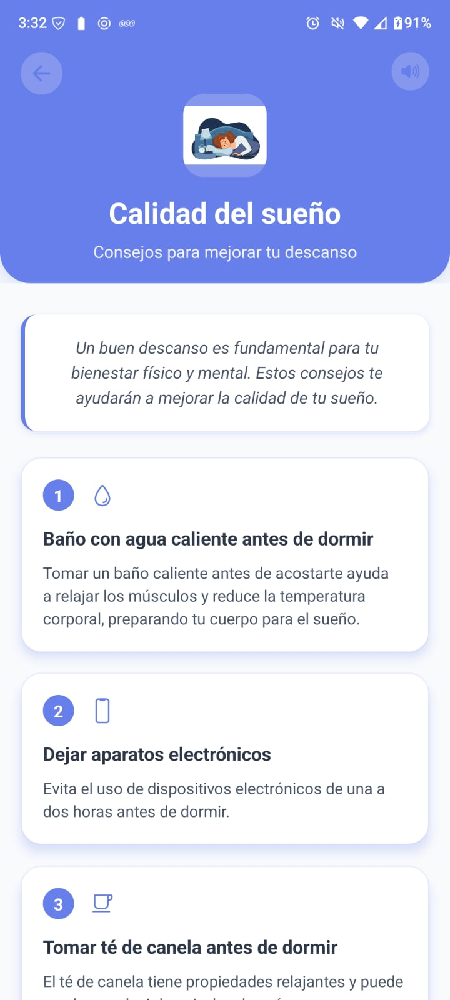

# PSM (Priorizando mi Salud Mental)

Proyecto universitario para brindar consejos y apoyo en diversos temas relacionados con la salud mental, tales como:

- Ansiedad  
- Calidad del sueño  
- TDAH  
- Estrés  
- Regulación emocional  
- Habilidades sociales  

Además, la aplicación incluye función de lectura en voz alta con opciones de voces personalizables.

---

## Tecnologías

<p align="center">
  
  &nbsp;&nbsp;&nbsp;&nbsp;
  
</p>

Esta aplicación está desarrollada con **React Native** utilizando **Expo Go**, una librería que facilita la visualización y pruebas en dispositivos Android e iOS.  
La versión del SDK usada es la **53** de Expo.

---

## Cómo usar / Deployment

Para ejecutar este proyecto localmente, sigue estos pasos:

1. **Instala las dependencias**

```bash
npm install
```
2. **Ejecuta la aplicación**

```bash
npx expo start
```
3. **Opcional: Ejecutar con conexión pública**

```bash
npx expo start --tunnel
```

## Capturas de la aplicación
<p align="center">
  
  &nbsp;&nbsp;&nbsp;&nbsp;
  
   &nbsp;&nbsp;&nbsp;&nbsp;
  
  
   &nbsp;&nbsp;&nbsp;&nbsp;
  
  
   &nbsp;&nbsp;&nbsp;&nbsp;
  
</p>